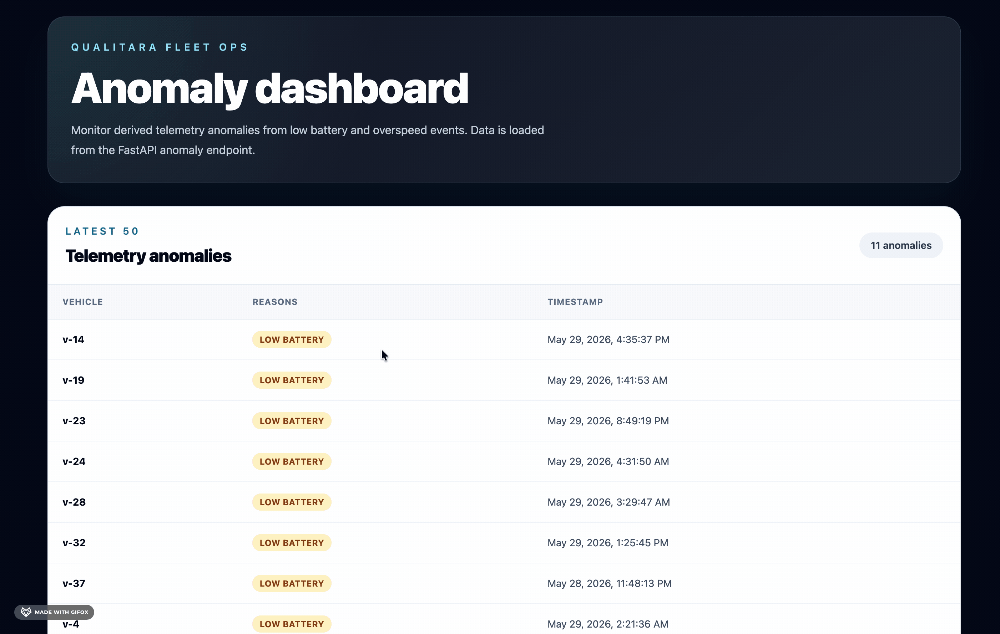

# Fleet Dashboard for Vehicles Telemetry

Modern FastAPI + React TypeScript fleet dashboard for vehicles telemetry.



## Stack

- FastAPI backend managed with `uv`
- React TypeScript frontend built with Vite
- PostgreSQL for local development through Docker Compose
- SQLAlchemy and Alembic for database access and migrations

## Agentic Session History

See [opencode_session_history.md](opencode_session_history.md) for the development session log.

## Quick Start

Start Postgres:

```bash
docker compose up -d postgres
```

Run migrations and seed local data. Seed vehicles first, zones second, and telemetry last:

```bash
uv run alembic upgrade head
uv run python -m backend.app.seed_vehicles
uv run python -m backend.app.seed_zones
uv run python -m backend.app.seed_telemetry
```

Start the API:

```bash
uv sync
uv run uvicorn backend.app.main:app --reload
```

Start the frontend:

```bash
cd frontend
npm install
npm run dev
```

Visit http://localhost:5173.

## Configuration

Copy the root `.env.example` to `.env` for backend settings.

Copy `frontend/.env.example` to `frontend/.env` for frontend settings. The frontend uses `VITE_API_URL` to reach the FastAPI backend.

## API

- `GET /` - API metadata
- `GET /api/health` - application health
- `GET /api/health/db` - PostgreSQL health
- `POST /api/telemetry` - ingest a telemetry event
- `GET /api/telemetry` - list latest raw telemetry events
- `GET /api/events` - list the latest telemetry event per vehicle
- `GET /api/anomalies` - list derived telemetry anomalies
- `GET /api/vehicles` - list vehicles
- `GET /api/zones/counts` - list zone entry counts

## Realtime

The frontend connects to Socket.IO at `/dashboard.io`.

Server-emitted events:

- `telemetry:created` - emitted after a telemetry event is ingested
- `anomaly:detected` - emitted when an ingested telemetry event is anomalous
- `zones:count_changed` - emitted when telemetry increments a zone counter
- `vehicles:status_changed` - emitted when telemetry changes a vehicle status

## Migrations

Create a migration:

```bash
uv run alembic revision -m "describe change"
```

Run migrations:

```bash
uv run alembic upgrade head
```

## Tests

Run backend tests:

```bash
uv run pytest
```

Run Python lint checks:

```bash
uv run ruff check .
```

Build the frontend:

```bash
cd frontend
npm run build
```
